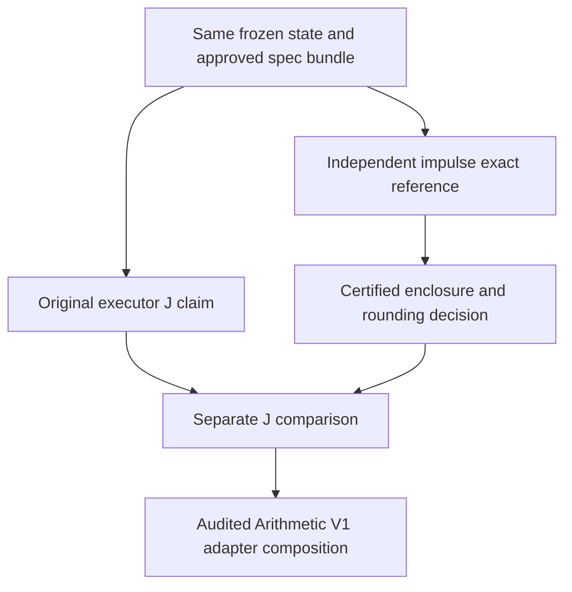

# C1-B1 Independent Impulse V1 — 설계 제안

기록일: 2026-10-04. **DESIGN ONLY / NOT IMPLEMENTED / NOT AUDITED.**

이 문서는 `65d8fd29ae255529afead70289098d36b825b3b4`의 Arithmetic V1 제한 독립 재감사 PASS 이후 다음 oracle의 수학·수치 계약을 검토하기 위한 제안이다. 설계 문서 작성은 구현 승인, 독립 감사, 물리 인증이 아니다. **J_NOT_VERIFIED / NotCertified를 유지한다.**

## 1. 목표, 범위, 이번 산출물

같은 고정된 상태와 명시적으로 승인된 specification bundle에서 stage impulse J를 독립 계산한다. executor supplied J는 oracle의 입력이나 expected answer generator가 아니라 **계산 완료 후 비교할 claim**이다.



V1의 최초 단위는 **한 상태의 한 pair half-kick J 3성분**이다. 동일한 J를 i에 빼고 j에 더하는 의미를 명시한다. 이후 composition에서 K → D → K를 검사할 수 있으나, 이번에는 배선·실행하지 않는다. 두 번째 J는 drift 후 상태에서 다시 계산하는 다른 입력이다.

이번 범위 밖: impulse 코드, fast impulse, 원본 executor 변경, exact_fast default 승격, r_min의 Lab 물리 binding 확정, trajectory·full replay·N-Step, native/GPU, 근사·cutoff, 성능 승격, C1-B1 전체 freeze. 기존 Arithmetic V1의 여섯 보호 파일과 adapter도 수정하지 않는다.

**`exact`의 의미:** 정확한 모델식의 참값을 sound enclosure로 감싸고 stored J의 올바른 반올림을 결정한다. 일반적인 J를 유리수 하나로 정확히 표현한다는 뜻이 아니다. 또한 KDK의 `F(state) × Δt/2`는 동결된 한 stage의 수학적 impulse다. 실제 연속 궤적에서 힘을 시간 적분한 `∫F(r(t))dt`와 항상 같다는 주장은 하지 않는다.

## 2. Authority와 provenance

사양의 우선순위는 **사용자가 승인한 physical/numeric 문서 → 공개 원자료의 식·계수 → 별도 수학적 유도**다. 원본 executor 코드에서 현재 연산 순서를 보고 사양을 역으로 정의하지 않는다. 문서 안의 과거 proposal과 이후 판정을 구분한다.

원 프로젝트 체크아웃: `C:/Users/zun24/성공은 실패의 어머니`, HEAD `0f7b744cf754450424a63c47f305e0327c5b37c1`. A-EV 별도 체크아웃: `C:/Users/zun24/.codex/worktrees/a-ev-audit/성공은 실패의 어머니`, HEAD `27e48770ab5db666bcd78034d151ddbb04b6af54`. 둘 다 소스 조사 시 clean이었다. 원자료는 `D:/reference/ar2_lang2024/S2_ar2_pot.f90`이다.

아래 ID의 전체 경로, commit, Git blob OID, **raw SHA-256와 CRLF→LF SHA-256을 각각** [specification-source-provenance.json](../current/c1b1-arithmetic-v1-independent-reaudit-2026-10-04/specification-source-provenance.json)에 기록했다. 해시는 출처를 고정하며 수학적 타당성을 대신하지 않는다. 원 프로젝트 파일은 raw CRLF와 Git LF가 다른 경우가 있으므로 두 해시를 혼동하지 않는다.

| ID | source document / 원자료 | 읽은 범위와 지위 |
|---|---|---|
| P0 | [S2_ar2_pot.f90](D:/reference/ar2_lang2024/S2_ar2_pot.f90) | coefficient declarations, V, formShort, formLong, dampTT/shftTT의 수학 정의, retar. 공개 식·계수의 원자료. floating runtime 분기는 사양이 아님 |
| S1 | [C1A_AR2_FREEZE_V1.md](<C:/Users/zun24/성공은 실패의 어머니/docs/frozen/C1A_AR2_FREEZE_V1.md>) | 전체. §1–4: frozen `c1a-ar2-lang2024-v1` |
| S2 | [A_MICRO_V6_C1B1_TWO_ATOM_DYNAMICS_DESIGN_V1.md](<C:/Users/zun24/성공은 실패의 어머니/docs/active/A_MICRO_V6_C1B1_TWO_ATOM_DYNAMICS_DESIGN_V1.md>) | §1–4, §6, §10, §12, §14, §23 관련 부분. §4의 D3–D6와 후속 판정; C1-B1 전체 freeze는 보류 |
| S3 | [A_NUMERIC_EXECUTION_STACK_V1.md](<C:/Users/zun24/성공은 실패의 어머니/docs/reference/A_NUMERIC_EXECUTION_STACK_V1.md>) | §3.2 및 §7.1–7.5. composite once-rounding과 독립 감사 요구 |
| S4 | [C1B1_EXACT_IMPULSE_CERTIFICATE_SPEC_V1.md](<C:/Users/zun24/성공은 실패의 어머니/docs/active/C1B1_EXACT_IMPULSE_CERTIFICATE_SPEC_V1.md>) | §0–4 및 관련 한도·후속 기록. 승인된 point certificate 사양; Lab 신규 구현의 승인 아님 |
| S5 | [C1B1_EXACT_IMPULSE_CHECKER_V2_DESIGN.md](<C:/Users/zun24/성공은 실패의 어머니/docs/active/C1B1_EXACT_IMPULSE_CHECKER_V2_DESIGN.md>) | §0–8, §9.6–9.7. 머리말의 승인 대기 기록보다 후속 §9.7 신뢰 승인이 나중. formal certified 아님 |
| S6 | [C1B1_RUNTIME_ROUNDING_CONTRACT_V1_PROPOSAL.md](<C:/Users/zun24/성공은 실패의 어머니/docs/active/C1B1_RUNTIME_ROUNDING_CONTRACT_V1_PROPOSAL.md>) | §0–9 및 P1b/Q-PC2 후속 문구. RESOLVED/STOP, availability와 truth 분리 |
| S7 | [C1B1_POINT_PROVER_DESIGN_V0.md](<C:/Users/zun24/성공은 실패의 어머니/docs/active/C1B1_POINT_PROVER_DESIGN_V0.md>) | 역할, 알고리즘, 비신뢰 추정·한도·후속 계보 관련 부분. 참고 자산 |
| S8 | [C1B1_POINT_PROVER_COMPLETENESS_AUDIT_V0.md](<C:/Users/zun24/성공은 실패의 어머니/docs/active/C1B1_POINT_PROVER_COMPLETENESS_AUDIT_V0.md>) | §0–9. 역사적 H1/H2와 후속 수정 구분. 새 oracle의 completeness 증명으로 이관하지 않음 |
| S9 | [C1B1_ROUNDING_DECISION_V1.md](<C:/Users/zun24/성공은 실패의 어머니/docs/active/C1B1_ROUNDING_DECISION_V1.md>) | 상태 및 §1–2. EXP cutoff와 양끝 overflow 오판의 역사적 반례 |
| S10 | [C1B1_PRODUCTION_REPLAY_VERIFIER_V1.md](<C:/Users/zun24/성공은 실패의 어머니/docs/active/C1B1_PRODUCTION_REPLAY_VERIFIER_V1.md>) | 고정 전이 계약, 검증 의미, 의존성 부분. 별도 승인된 replay 자산; 이번 범위로 이관하지 않음 |
| A1/A2 | [A-EV force source](<C:/Users/zun24/.codex/worktrees/a-ev-audit/성공은 실패의 어머니/audit/independent_physics/ar2_force_enclosure.py>), [Phase 1 report](<C:/Users/zun24/.codex/worktrees/a-ev-audit/성공은 실패의 어머니/docs/active/A_EV_PHASE1_INDEPENDENT_FORCE_AUDIT.md>) | imports, interval/exp/parameter parser, derivative·impulse 조립, Phase 1 범위 관련 부분. 별도 계산 자산이지 전체 A-EV closure 아님 |

원 프로젝트 AGENTS.md와 RULES.md는 읽었고 CURRENT_STATE.md / REPO_MAP.md는 진입부와 C1-B1 관련 부분만 읽었다. 모든 원 프로젝트 문서·소스 전체를 읽은 감사라고 주장하지 않는다. 실행기·checker 코드는 계보와 인터페이스를 위한 정적 조사만 했다. 새 물리 계산·시험·auditor 실행·timing은 수행하지 않았다.

### 2.1 요구 항목별 specification 판정

`frozen`은 원 프로젝트 S1의 동결 부분, `adopted`는 원 프로젝트의 명시적 후속 판정, `candidate`는 이 Lab에 제안하는 새 binding/구현 계약, `unresolved`는 추가 검토가 필요한 Gate를 뜻한다. 원 프로젝트에서 adopted였다는 사실만으로 Lab 신규 bundle이 승인되지는 않는다.

| 항목 | authoritative source / section | 채택하려는 의미 | 지위 |
|---|---|---|---|
| V(R) | S1 §1; P0 V/formShort/formLong/retar | BO+REL+QED, retardation ON, 정확 십진 계수. §3의 실수 해석식 | frozen physical model |
| dV/dR, radial force | S1 §1; S4 §3.5 | 해석 미분, `F_real=-V_real′`. 반올림된 C1-A F를 J 입력으로 사용하지 않음 | frozen 정의 + S2 adopted 합성식 |
| relative q와 방향 | S2 §4 D3–D5 | `q=r_j-r_i`, `R²=q·q`, 힘 on j = `F_real q/R` | adopted |
| impulse sign | S2 §4 D5 | 공통 J on j; `Δp_i=-J`, `Δp_j=+J` | adopted |
| half/full factor | S2 §4 D5–D6, §6.1 | KDK full Δt에 대해 각 kick `h=Δt/2`. 기본 full dt=40 a.u.는 해당 C1-B1 범위의 판정 | adopted 원본; Lab binding candidate |
| mass dependence | S2 §4 D1–D2, D5–D6 | 주어진 위치·h에서 J에는 질량 인자 없음. mass는 drift와 상태 생성에 사용 | 식에서 유도; 신규 전사 proof OPEN |
| units | S1 §1; S2 §4 D1/§6.1 | R bohr, V hartree, F hartree/bohr, h atomic time, J momentum a.u. | 기존 계약; bundle의 unit labels candidate |
| R | S2 §4 D4 | 저장 위치의 정확 차와 정확 R²; `R=√R²`를 먼저 storage grid로 반올림하지 않음 | adopted |
| R=0 / invalid | S1 §1; S2 §4 D7 | R=0은 inverse 이전 거부. 실제 R²가 physical lower bound 미만이면 physical-domain refusal. equality 허용 | frozen 하한; **Lab physical binding unresolved** |
| inverse/powers/exp | P0 수학 정의; S4 §3.3–3.5; S3 §7.1 | real sqrt/exp/역수/정수 powers. P0의 EXPTHR·double thresholds를 물리식에 이식하지 않음 | physical semantics 고정; 독립 primitive candidate |
| rounding 위치 | S2 §4 D5; S3 §7.1–7.3 | `RN_even(2^Fmom · h · F_real · q_k/R)` 한 번. rounded R/F의 재사용 금지 | adopted |
| interval 의미 | S4 §3; S5 §1–2 | 모든 끝점은 exact rational, 닫힌 구간이 참값을 포함. proof enclosure widening은 상태 quantization 아님 | 승인된 근거; 새 구현 proof OPEN |
| precision escalation | S6 §1/§7, S3 §7.2 | 구간으로 cell이 정해지지 않으면 정밀화; 원본 schedule은 oracle truth contract 아님 | 원칙 adopted; 신규 schedule candidate |
| STOP/refusal | S6 §1·§2.1; S4 §3.7 | unresolved→STOP/UNPROVED; operational limit은 가용성 거부. 전 입력 불변 | adopted 원칙; 신규 codes candidate |
| J→momentum grid | S2 §14; S4 §2/§3.6; Lab manifest kick/fixed_point | 첫 검토 대상 FX(96,80), nearest_even, refuse overflow. momentum grid=impulse grid | 원본 adopted; **Lab 물리 연결 candidate** |
| dt/profile/whole freeze | S2 §6, §12, §14.3; S10 고정 전이 계약 | 기존 dt=40, pos FX(96,48), mom FX(96,80)을 최초 비교 baseline으로 제안. 전체 C1-B1 frozen으로 쓰지 않음 | 원본 adopted / whole freeze 보류 |

### 2.2 제안하는 최초 bundle와 승인 전 차단

최초 검토 대상은 **Ar40–Ar40 / c1a-ar2-lang2024-v1 / retardation ON / position FX(96,48) / momentum=impulse FX(96,80) / full dt=40 / half factor=1/2**다. 새 물리 숫자를 고른 것이 아니라 S1·S2·S10의 기존 계약 조합을 Lab의 별도 bundle로 가져올지를 제안한다. 다른 종·profile·dt를 지원하려면 다른 명시적 bundle이 필요하다.

`physical_spec_id`와 `numeric_spec_id`의 최종 이름·canonical bytes·hash는 **미발급 / 검토 대기**다. 이 문서에서는 잠정적으로 `Independent Impulse V1 proposed bundle`이라고만 부른다. 승인되지 않은 ID나 빠진 binding을 default로 채우는 경로는 없다. 특히 Lab manifest의 `physical_r_min_unit_binding=PENDING`을 코드 편의 때문에 해제하지 않는다.

기존 C1-A physical lower bound의 **제안 값**은 정확 유리수

`r_min_bohr = (6/5) / (529177210903/10^12)`

이며 `R² < r_min_bohr²`에서 거부한다. 자료 출처 변환과 physical-domain 정책을 포함하는 별도 binding 승인 전에는 이 값을 Lab geometry의 물리 threshold로 확정하지 않는다. Arithmetic V1의 exact threshold geometry PASS는 이 물리 승인과 별개다.

## 3. A층 — 반올림 전 physical mathematical impulse

저장 위치 raw `r_i_raw,r_j_raw`와 position frac bits `Fpos`에서:

```text
r_i = r_i_raw / 2^Fpos; r_j = r_j_raw / 2^Fpos
q = r_j - r_i                       # q는 relative position; 전하가 아님
s = R² = q_x² + q_y² + q_z²         # exact rational
R = sqrt(s)                         # exact real / 대개 algebraic irrational
h = Δt / 2                         # exact rational stage factor
F_real(R) = -dV_real(R)/dR
J_real,j,k = h · F_real(R) · q_k / R
J_real,i,k = -J_real,j,k
```

`E(r_i,r_j)=V(|r_j-r_i|)`에서 `∇_j R=q/R`, `∇_i R=-q/R`이므로 `-∇_j E=-V′q/R`, `-∇_i E=+V′q/R`다. 이는 S2 D5의 sign convention과 일치한다. 질량이나 현재 운동량은 이 고정 상태의 힘식에 등장하지 않는다. 이 유도 자체는 문서상의 수학 근거이며 새 코드의 전사·건전성 검증은 I3–I8로 남긴다.

### 3.1 V와 analytic derivative의 정확한 식

family `c ∈ {BO,REL,QED}`, short index `j=1,2`에 대해 `P_cj(R)=Σ_i a_cij R^i`다. BO에는 i=-1 항이 있으므로 단순 polynomial만으로 부르면 안 된다.

```text
x_c = η_c R
S_n(x) = Σ_{i=0..n} x^i/i!
T_ck(R) = exp(-x_c) S_(2k+kadd_c)(x_c)

g(R) = N(R)/D(R)
N(R) = 1 + Σ_{m=1..5} A_m R^m
D(R) = 1 + Σ_{m=1..6} B_m R^m
g′(R) = (N′D - ND′)/D²

D_ck(R) = g(R) - T_ck(R)   for BO,k=3, retardation ON
          -T_ck(R)         for REL,k=2, retardation ON
          1 - T_ck(R)      otherwise (including all QED terms)

V_c(R) = Σ_{j=1,2} exp(-α_cj R) P_cj(R)
         - Σ_{k=Kmin_c..Kmax_c} C_c,2k D_ck(R) R^(-2k)
V_real = V_BO + V_REL + V_QED

b_ck(R) = η_c exp(-x_c) x_c^(2k+kadd_c)/(2k+kadd_c)!
D′_ck(R) = b_ck(R) + g′(R)  for BO,k=3
           b_ck(R)          otherwise

V′_c(R) = Σ_j exp(-α_cj R) [P′_cj(R) - α_cj P_cj(R)]
          - Σ_k C_c,2k [D′_ck(R) R^(-2k)
                         - 2k D_ck(R) R^(-2k-1)]
```

`T′=-η exp(-x)x^n/n!`이므로 세 D 분기의 base derivative는 모두 `+b_ck`다. BO 선도항에는 반드시 `g′`가 추가된다. REL 선도항을 일반 TT damping `1-T`로 처리하면 retardation ON 모델이 바뀐다. 이 두 분기와 BO의 i=-1 미분을 전사 감사와 mutation의 별도 표적으로 둔다.

P0의 `V(R,ret=true)` 전체 조합을 채택한다. 개별 `V_BO/V_REL` 호출의 non-retarded convenience 형태를 전체 retarded 물리 모델로 잘못 사용하지 않는다. P0의 double-precision underflow 분기, damping의 finite loop termination, `limit1/limit2/EXPTHR`는 평가 구현이다. **정확 모델의 exp나 긴 꼬리를 0/1로 대체하는 물리 규칙이 아니다.**

### 3.2 Constants의 정확한 binding 제안

P0 raw SHA-256: `a598057183121b9c928b3a9804c8e2e99afa553bad570a471aa4130f20e6b049`.

S4가 문서화한 C1-A parameter fingerprint: `ada6153be05af3e582139fdc81b5697fffaf18d12f9f2de6e8d5ac2fdfe0839e`. 기존 compatibility fingerprint에는 σ 데이터도 들어간다. σ를 J에 더하거나 coefficient uncertainty를 enclosure rounding error로 섞지 않는다.

계수는 P0의 decimal token을 exact rational로 읽는 별도 data bundle을 제안한다. 승인된 source bytes와 전사한 bundle을 둘 다 결합한다. executor의 상수 배열이나 fingerprint 함수를 실행해 oracle data를 만드는 경로는 없다. fingerprint 형식은 S4 §3.1의 사양을 바탕으로 별도 문서화·검증해야 한다.

| family | α_1, α_2 | short exponents / `(a_i)` in ascending i | η | k range / kadd |
|---|---|---|---|---|
| BO | 6.92639712, 2.34781022 | i=-1..2; j1=(2.19578828e4, 6.77672149e4, 8.52129476e4, 9.53252754e4); j2=(-2.16338828e4, 3.18311293e4, -8.18603449e3, 8.37564742e2) | 3.65946625 | k=3..8 / 1 |
| REL | 1.66833595, 3.07137482 | i=0..2; j1=(-3.55673715e0, 7.59367220e-1, -4.19874548e-2); j2=(-2.83560129e1, 1.64892143e1, 7.19542232e0) | 1.05249333 | k=2..4 / 0 |
| QED | 1.64936036, 2.29848003 | i=0..2; j1=(-1.2621862e-1, 1.176436e-2, 0); j2=(0, 0, 6.921721e-2) | 3.91638946 | k=3..4 / 0 |

| data | exact decimal coefficients in source order |
|---|---|
| BO C_2k, k=3..8 | 64.2295222, 1503.45262, 49033, 1828012, 81913453, 4294913366 |
| REL C_2k, k=2..4 | -9.43594504e-4, 1.76276088e-1, 3.99787449e-1 |
| QED C_2k, k=3..4 | -1.949525e-2, -4.8877359e-1 |
| A_1..A_5 | 3.064827731712776e-01, 4.843969950480238e-03, 7.793815409352866e-06, 1.031221966985517e-14, 4.204140311858030e-12 |
| B_1..B_6 | 3.064827731712776e-01, 4.858660928580025e-03, 1.156839432134599e-05, 1.670845939899731e-08, 2.151070686307512e-17, 8.769598859882065e-15 |

표의 decimal은 모두 exact rational로 해석한다.

단위는 기존 계약에 따라 거리 bohr, 에너지 hartree, 시간 atomic time, 운동량 atomic momentum이다. `hartree/bohr × atomic time`을 momentum 단위로 취급하며 임의의 SI 변환 상수를 추가하지 않는다. 상수·모델의 측정 불확도는 provenance/model error ledger에 남기고 명목 모델의 exact evaluation과 구별한다.

Ar40 mass의 기존 정의는 S2 §4 D1의 `39.9623831237 / 5.485799090441e-4`다(m_e 단위, 두 decimal 명목값의 exact rational 비). J evaluator의 수치 인자로는 필요하지 않지만, 같은 상태에서 Arithmetic drift로 연결하는 composition의 species/mass binding에는 필요하다. 새 CODATA 판 선택이나 mass 값 조정은 하지 않는다.

## 4. B층 — numeric representation과 correctness 계약

초기 supported profile의 **제안**은 position FX(96,48), momentum/impulse FX(96,80)다. Arithmetic V1의 2..4096 width 지원을 Impulse V1도 자동으로 지원한다고 쓰지 않는다. unsupported profile은 명시적으로 거부한다.

`u=2^-Fmom`, `y_k=J_real,j,k/u`라 두면 `J_raw[k]=RN_even(y_k)`다. 출력 raw 범위는 `[-2^(Wmom-1), 2^(Wmom-1)-1]`. 중간 R/F/시간 인자/powers를 momentum grid로 양자화하지 않는다.

분수 입력·상수·구간 끝점·비교는 Python exact integer와 표준 Fraction을 신뢰 기반으로 삼는 안이다. sqrt/exp의 값은 interval로만 표현하고 endpoint 산술은 정확하다. 이 신뢰 기반의 구현 올바름까지 형식 증명했다고 주장하지 않는다. host float, Decimal, mpmath point value는 최초 reference의 decision path에서 사용하지 않는 안을 권고한다.

## 5. Minimal plain-data 입력 제안

아래는 **field 의미의 제안**이다. 최종 JSON schema/version/bytes hash는 검토 뒤 별도 사양으로 발급한다. executor의 Run/Atom/profile 객체·callable·cached J를 전달하지 않는다.

| 구분 | field / exact 의미 | 근거와 validation |
|---|---|---|
| 좌표 | `r_i_raw[3]`, `r_j_raw[3]` | S2 D2–D4. signed raw integers, i/j와 xyz 순서 고정. position grid 범위 확인 후 정확 차 |
| grid | `position_grid`, `momentum_grid`, `impulse_grid` | kind, width, frac_bits, nearest_even, overflow=refuse. 등록 bundle과 byte/semantic equality; momentum=impulse |
| pair species | `species_i`, `species_j` | 최초 Ar40 두 원자만. 임의 coefficient table을 request에 넣지 않고 승인된 constants binding 참조 |
| 시간 | `full_dt` exact rational, `kick_fraction=1/2` | `h=full_dt*kick_fraction` 직접 계산. 최초 제안 bundle의 full_dt=40와 일치해야 함. `dt_kick=20`을 독립 default로 채우지 않음 |
| stage 식별 | `phase`: first_half_kick / second_half_kick | 수학식은 같지만 다른 acquisition occurrence. half/full-step 혼동 검사 |
| spec 결합 | `physical_spec_id/hash`, `numeric_spec_id/hash`, `constants_id/hash` | 승인 bundle 모두 required. unknown/missing/stale는 거부; executor 함수를 호출해 보완하지 않음 |
| acquisition | `record_id`, `acquisition_id`, `state_payload_hash`, phase provenance | 비교할 두 계산이 같은 수집 입력인지 결합. 식에는 영향 없음; 같은 bits여도 다른 occurrence는 별도 record |
| 별도 실행 정보 | executor commit/source fingerprint, acquisition tool fingerprint | comparator의 provenance 영역. oracle 수학 입력을 executor 출력으로 변경하지 않음 |
| 운영 budget | N0, P0, Nmax, Pmax, max_attempts, exp_order_max, integer_bit_max, work/byte/time caps | 전부 finite이며 receipt에 명시. 최종 기본 수치는 미정. truth spec과 별도 availability policy |

absolute positions를 받아 relative q를 직접 구하는 방식을 기본으로 제안한다. q-only 입력을 나중에 열 경우 signed q_raw의 범위는 위치 범위와 다르며, `|q_raw|<2^96`인 정확 차를 허용해야 한다. q-only에 대해서는 absolute acquisition과의 연결을 별도 증명해야 한다. 최초 V1에서는 두 입력형을 동시에 허용하지 않는 편이 감사하기 쉽다.

현재 momentum, mass는 oracle J의 필수 수학 입력에서 뺀다. composition의 Drift/KickInput에는 별도로 필요하다. `external_J_raw`는 **oracle request에 넣지 않고 comparator request에만** 둔다. 외부 J에 맞게 정밀도나 raw 후보를 고르는 권한은 없다.

한 점의 impulse oracle은 초기 E_rel admission이나 D_valid 분류를 수행하지 않는다. potential domain 안의 J를 판정했다는 사실은 그 상태가 현재 integrator의 지원 초기 상태라는 판정이 아니다. 미래 composition에서 초기 입장 계약이 필요하면 momentum·species/mass·energy 근거를 별도 gate로 결합해야 한다. 이번에는 새 energy admission 검사나 trajectory 검증을 구현하지 않는다.

canonical wire에는 bool/float/비정규 decimal/duplicate·unknown key를 허용하지 않는 안을 제안한다. rational은 gcd 약분, positive denominator, zero=0/1. position raw와 h는 소수 문자열을 float로 해석하지 않는다. 입력 validation → spec binding → physical domain → primitive 평가 → rounding 순서를 고정하며 zero-component shortcut도 spec/domain 검사 이후에만 허용한다.

canonical baseline은 positive full_dt=40이고 arbitrary negative/zero dt 물리 실행은 지원하지 않는 안이다. zero/negative exact scalar와 동점 처리는 numeric primitive 단위 검증에 사용할 수 있으나, 이를 새 물리 domain 지원으로 쓰지 않는다. 시간역전이나 다른 dt 지원은 별도 bundle 검토 사항이다.

## 6. Output과 proof artifact 제안

최종 결과는 다음 의미를 갖는 별도 ImpulseResult record다. 기존 Arithmetic Result의 `scope=ARITHMETIC_ONLY`, `j_status=J_NOT_VERIFIED`를 고쳐 쓰지 않는다.

| 필수 artifact | 감사 의미 |
|---|---|
| input/spec/budget binding | exact 입력 digest와 실제 승인된 constants/units/profile/method/implementation source hashes |
| `q`, exact `R²` | 위치 raw→exact relative rational 전사의 증거 |
| radius `[r_lo,r_hi]`, sqrt_bits | `r_lo²≤R²≤r_hi²`, positive lower end; singleton인지 여부 |
| `dVdR` interval by BO/REL/QED, total | analytic derivative의 전사·부호·누락 조사에 필요한 수학적 분해 |
| `F_real`, `F_real/R` intervals | radial derivative 부호와 1/R 인자 추적 |
| J_real 3 component intervals | `h*q_k` exact scalar와 참 impulse의 포함 관계 |
| scaled y interval과 rounding cell | raw m, cell bounds, even/odd endpoint policy, subset proof |
| final `J_raw[3]` | 3성분 모두 resolved·range-valid일 때만 공개 |
| precision/attempt history | 각 N/P, exp range reduction/차수/tail bound, refuse/정밀화 이유, 실제 종료 budget |
| status/reason | RESOLVED 또는 REFUSED/UNPROVED. comparator verdict와 독립된 상태 |

radial direction은 q와 positive R enclosure에서 유도할 수 있다. 별도 `q/R` 벡터 artifact는 선택 사항이며 그것을 재반올림해 J를 만들지 않는다. detailed derivative terms(TT base, BO g′ 등)는 진단 artifact로 선택적으로 남기되, 총식·포함 불변식 검증이 생략되지 않게 한다.

executor의 내부 limb/order/cache/Taylor transcript는 복제하지 않는다. 위 값은 수학적 증거이지 원본 trace를 재현한 것이라는 주장이 아니다. **oracle 자신이 출력한 interval/status만으로 독립 검증이 끝나지 않는다.** 별도 checker가 입력과 method parameter에서 다시 참 enclosure를 구성하거나, 모든 primitive inequality의 증명 객체를 검증해야 한다. 최초 독립 reviewer는 reference와 같은 helper를 자기 checker로 재사용하지 않는다.

F-CLAIM-1의 경계 원칙을 새 artifact에도 적용한다. canonical numerator/denominator를 약분한 exact integer로 만든 뒤, decimal 변환 **전에 정수 비교**로 표현 범위를 검사한다. process-global `sys.set_int_max_str_digits(0)`은 금지한다. Claim V1을 통해 표현하는 computed artifact에는 이미 감사된 4096 digits 계약이 적용된다.

새 Impulse wire의 input/proof output digit/byte limit와 encoding은 **별도 미확정 Gate(U4)**다. 최초 검토안은 canonical rational integer 각각 4096 decimal digits와 명시적 total-byte cap이다. 채택하면 `abs(n)<10^4096`, `0<d<10^4096` 검사 뒤에만 decimal serialization한다. 큰 proof를 잘라내거나 성공 status만 반환하지 않고 `REFUSED / artifact_output_limit`로 종료한다. 내부 enclosure가 이미 cell을 증명했더라도 외부 proof를 안전하게 출판하지 못하면 완전한 RESOLVED artifact를 제공하지 않는다. Claim V1의 schema를 Impulse V1처럼 가장하지 않는다.

## 7. Independent primitive / enclosure 전략

세 안을 비교한다.

| 안 | 장점 | 부담 / 독립성 조건 | 제안 |
|---|---|---|---|
| A. 새 exact rational reference + 증명 가능한 sqrt/exp interval | 정수 부등식과 rational endpoint로 전 과정을 검토 가능. executor와 구현 분리 | 큰 분자/분모 비용, cancellation에서 느림. finite budget STOP 허용 | **최초 V1 권고** |
| B. 별도 rigorous interval backend + AD | 짧은 potential식에서 미분을 새 경로로 얻음. 기존 replay 자산과 교차 확인 가능 | backend·directed rounding·버전 신뢰 가정을 새로 감사해야 함. point precision만으로 enclosure 주장 불가 | 차후 독립 cross-check 후보 |
| C. 기존 checker/Point Prover/A-EV를 직접 이관 | 기존 point evidence 활용 가능 | 같은 helper를 복사하면 self-check; import 구조·parser/binding/rounding 범위가 다름. 기존 감사가 Lab 새 oracle로 자동 이관되지 않음 | V1 core로 직접 재사용하지 않음 |

최초 A는 S4와 같은 공개 수학 정리를 쓰되 그 checker 코드를 복사하지 않는다. 기법을 공유하는 것과 구현을 공유하는 것을 구별한다. reference에 비신뢰 mpmath estimate를 붙일 필요도 없다. 처음부터 자신이 계산한 certified interval로 raw 후보와 cell을 정한다.

### 7.1 Primitive별 exact / interval / proof 구분

| primitive | 계산 제안 | exact인 것 / 참값 포함 근거 | host float / 방향 |
|---|---|---|---|
| q, R² | raw integer 차, square/sum, power-of-two scaling | 모든 값 exact rational. intermediate width로 wrap하지 않음 | 없음 |
| sqrt(s) | N bits에서 `a=isqrt(floor(s*2^(2N)))` | `[a/2^N,(a+1)/2^N]`와 squared inequalities. exact equality가 확인되면 singleton | 정수 floor/isqrt만 |
| inverse R | positive ordered `[l,h]`→`[1/h,1/l]` | reciprocal 감소성. l≤0이면 분모 계산 금지; coarse sqrt면 정밀화, 실제 R=0이면 domain refusal | rational exact |
| R^m, inverse powers | positive R interval에 정수 powers | m≥0은 monotone endpoints, m<0은 inverse+positive power. R>0 의무 | rational exact |
| add/sub/mul | endpoint add; sub=[a.lo-b.hi,a.hi-b.lo]; mul=네 곱 min/max | interval inclusion의 elementary inequality | rational exact, 음수 끝점 모두 검사 |
| positive interval division | reciprocal 후 mul | denominator lower>0. sign-changing numerator는 네 endpoint 곱 | rational exact |
| exp(-x) | §7.2 range reduction+positive Taylor remainder+reciprocal+squaring | remainder upper가 참 exp를 포함. parameter와 integer comparison 남김 | 필요시 rational→dyadic floor(lo)/ceil(hi), float 없음 |
| P′, damping derivative, g′ | §3 analytic formulas의 별도 구현 | exponent i를 exact integer로 미분; BO i=-1, TT base, g′ 분기 모두 확인 | rational interval algebra |
| J construction | `(-V′ interval)*(1/R interval)*(h*q_k)` | 마지막 scalar exact, 부호에 따라 interval ends 교환. q_k=0이면 정확 0 | storage rounding 이전에는 J quantization 없음 |

알고 있는 physical lower bound로 radius enclosure의 lower end를 강화할 수 있다. 이는 참 R을 포함하는 구간에 알려진 부등식을 교차 적용하는 증명 연산이며 실제 R이나 입력 위치를 r_min으로 clamp하는 연산이 아니다. 해당 physical binding 승인 전에는 하지 않는다.

### 7.2 exp enclosure의 수학적 근거

point x≥0에서 정수 s≥0를 exact comparison으로 골라 `x=2^s y`, `0≤y≤1/2`로 둔다. x=0이면 exp(-x)=1 exact다. `S_n(y)=Σ_(k=0..n)y^k/k!`, `t_(n+1)=y^(n+1)/(n+1)!`에 대해 나머지 항의 다음 비율은 `y/(n+2)` 이하이므로:

```text
0 ≤ exp(y)-S_n(y) ≤ U_n(y)
U_n(y) = t_(n+1)(y) / (1-y/(n+2))
1/(S_n(y)+U_n(y)) ≤ exp(-y) ≤ 1/S_n(y)
exp(-x) = exp(-y)^(2^s)
```

`n+2>y`를 exact rational로 검사한다. reduced y에서는 조건이 항상 만족하지만 검사·artifact를 생략하지 않는다. 유리수로 만든 local interval 폭이 `≤2^-P`가 될 때까지 n을 올리되 order/work/bit budget에서 종료한다. s회 positive interval squaring으로 exp(-x)를 감싼다. 끝점 크기 제한을 위해 각 squaring 뒤 dyadic widening을 쓸 경우 `floor(lo*2^P)/2^P`, `ceil(hi*2^P)/2^P`만 허용하고 widening 양을 구간 폭에 보존한다. negative rational floor와 truncation을 혼동하지 않는다.

interval x=[x_lo,x_hi]에서는 exp(-x)의 감소성으로 lower는 x_hi의 point lower, upper는 x_lo의 point upper를 쓴다. exp에 들어가는 모든 λ는 positive exact decimal rational이며 x_lo≥0을 먼저 검사한다.

local 목표 폭이 final exp나 J의 동일 폭을 보장한다고 쓰지 않는다. squaring, cancellation, R interval dependency를 포함하는 **실제 final J enclosure**로 결정한다. 고정 x에서 P→∞, n→∞이면 interval 폭이 0으로 가는 논증을 I6/I11에서 새로 검토한다. 무한 schedule의 정성 수렴과 finite operational budget의 termination 성공은 별개다.

고정 `x>=C`에서 exp를 정확 0으로 반환하는 지름길은 없다. `[0,epsilon]`처럼 증명된 상한을 가진 enclosure는 참 exp가 포함됨을 증명하면 가능하지만 최초 baseline의 필수 최적화로 넣지 않는다. physical cutoff나 coefficient 제거와 혼동하지 않는다.

### 7.3 Dependency, cancellation, derivative

같은 R와 exp(ηR)를 여러 항에 재사용하면 interval dependency로 폭이 커질 수 있다. 네 endpoint 산술의 soundness는 유지되나 interval midpoint를 참값으로 삼거나 cancellation term을 생략하지 않는다. 우물 바닥에서 작은 F가 큰 항들의 차로 나오는 사례를 별도 검증한다.

analytic derivative는 공개 V식으로부터 직접 미분한 §3식을 채택한다. high-precision finite difference는 진단 cross-check일 뿐 proof가 아니다. 별도 interval AD 방식은 독립 구현으로 전사 오류를 찾는 후속 cross-check 후보이며 reference와 같은 derivative helper를 쓰지 않는다.

## 8. Rounding cell과 overflow decision

`y=2^Fmom J_real,j,k`의 참값을 포함하는 rational interval `[L,U]`를 만든다. nearest_even의 raw m cell은:

```text
m even: C_m = [m-1/2, m+1/2]
m odd:  C_m = (m-1/2, m+1/2)
```

negative m에도 정수 parity가 그대로 적용된다. `[L,U]⊆C_m`을 exact rational comparison으로 확인하면 raw=m을 결정한다. even cell은 equality 허용, odd cell은 두 끝 모두 strict다. reference가 구한 interval만으로 후보를 찾으며 executor supplied raw를 cell 선택에 사용하지 않는다. 폭이 작다는 사실만으로 accept하지 않는다.

exact rational/singleton 입력에는 정수 quotient/remainder와 even parity로 RN_even을 결정할 수 있다. 실제 Lang J가 항상 rational이라는 뜻은 아니다. nontrivial exact midpoint가 interval로만 해결되지 않으면 별도 equality proof 또는 계속 정밀화가 필요하다. S4의 no-exact-tie Lemma A는 accepted design basis이며 frozen certificate가 아니므로 새 bundle의 모든 입력에 무검토 적용하지 않는다. 처음 V1은 completeness를 과장하지 않고 STOP을 허용한다.

signed raw 범위 `[m_min,m_max]` 안의 cell 중 하나로 결정되어야 한다. overflow는 현재 coarse interval의 **양 끝이 overflow**라는 이유만으로 선언하지 않는다. representable rounding cells 전체의 union은 `[m_min-1/2,m_max+1/2)`다(m_min은 even, m_max는 odd). 따라서:

- `U < m_min-1/2`이면 lower overflow가 증명됨.
- `L >= m_max+1/2`이면 upper overflow가 증명됨.
- interval이 이 union 경계를 걸치거나 음·양 끝을 동시에 넘으면 정밀화; finite cap이면 UNPROVED. 증명 없이 물리/표현 불가능이라고 선언하지 않음.
- range-valid raw 3성분이 모두 확정되기 전에는 J_raw vector를 publish하지 않음. range check 후 외부 artifact bound도 확인.

same-J kick의 i raw 변화는 `-m`, j 변화는 `+m`이다. i/J를 별도로 quantize하거나 서로 다른 J를 계산하지 않는다. signed raw 최소값 m_min의 부호 반전은 같은 signed grid에서 표현되지 않을 수 있으므로, `-m`을 별도의 valid raw 벡터라고 일반화하지 않는다. wide exact kick 산술로 처리한 뒤 각 updated momentum의 범위는 Arithmetic V1이 거부할 수 있다. 교환 대칭 시험은 양쪽 결과가 representable인 상태의 비트 관계와 비표현 상태의 refusal을 구분한다.

## 9. Precision escalation, STOP, input 불변

제안 schedule은 구현 전략이며 truth specification에 포함시키지 않는다. **N0/P0/max값은 아직 정하지 않았다.** 승인할 finite Budget에서 attempt t마다 `N_t=N0*2^t`, `P_t=P0*2^t`를 사용하고, exp 차수는 §7.2의 exact tail inequality로 고른다. 원본 128→…→16384나 Point Prover의 guard/margin을 복사하지 않는다.

```text
validate immutable plain input and approved bindings
→ exact q / R² / stage h and physical domain decision
→ attempt: independent sqrt / exp / derivative / J enclosure
→ all 3 components contained in representable rounding cells?
    yes → verify artifact representability → RESOLVED proof + J_raw
    no  → record ambiguous components and increase N/P within finite budget
→ any budget exhausted or arithmetic bounds undecidable → UNPROVED / STOP
```

order/bit/work limits는 큰 계산 **전에** 확인하고, 반복/분모/byte/time 한도마다 안전한 경계에서 확인한다. time cap만으로 단일 큰 integer operation의 강제 중단을 보장한다고 쓰지 않는다. 결정적 work/bit caps를 기본으로 하고 hard deadline이 필요하면 후속 구현에서 별도 worker 격리를 검토한다. arbitrary exception을 성공이나 expected REFUSED로 삼키지 않는다; programming fault는 별도 오류 record와 STOP이며 원인을 보존한다.

| outcome / 제안 reason | 의미 | 이후 처리 |
|---|---|---|
| RESOLVED | approved spec에서 sound enclosure + exact cell decision + raw/artifact 범위 확인 | comparator가 독립 J와 외부 claim 비교 가능 |
| REFUSED / specification_unbound 또는 unsupported | 누락·미승인 physical/numeric/constant/profile binding | STOP; default/근처 spec으로 보완 금지 |
| REFUSED / input_contract | 잘못된 plain data 또는 stage mismatch | STOP; 입력 교정 없음 |
| REFUSED / physical_domain | 승인된 하한 위반 또는 R=0 | STOP; clamp/반사/외삽 금지 |
| REFUSED / output_unrepresentable | 참 raw가 grid 밖임이 enclosure로 증명됨 | STOP; saturation/wrap 금지 |
| UNPROVED / precision_or_work_budget | sound interval이 cell/overflow를 확정하지 못한 채 finite cap | STOP; guess 금지. 입력이 틀렸다는 판정 아님 |
| REFUSED / artifact_output_limit | mathematical decision을 wire/proof 범위 안에 표현할 수 없음 | STOP; arithmetic/physical failure와 구분 |

reason 이름은 신규 사양 제안이며 기존 Lab Failure code 목록을 수정하지 않는다. comparator의 MATCH/MISMATCH/UNPROVED와 oracle의 계산 상태는 다른 필드다. executor overflow/refusal과 이 새 reason의 외부 exception priority compatibility는 별도 검토 대상으로 둔다.

입력은 immutable plain-data snapshot을 validate 후 고정한다. 전 attempt의 중간 값은 local proof builder에만 둔다. RESOLVED 이전에는 세계/Run/cache/Arithmetic input/result를 변경하거나 partial vector를 publish하지 않는다. 실패·refusal·mismatch에서도 같은 snapshot이 유지된다. serialization limit 시험의 입력 불변 검사는 huge integer의 `repr/str`를 먼저 부르는 방식으로 만들지 않는다.

## 10. 독립성 경계와 기존 자산 계보

조사는 정적 import/call 경로와 관련 source 구간을 확인한 수준이다. import 목록만으로 동적 독립성·식 전사의 완전성을 증명하지 않는다. provenance JSON의 L1–L9와 A1/A2에 inspected source hash를 남겼다.

| 자산 | 확인한 실제 관계 | 공유 / 재사용 판정 |
|---|---|---|
| c1b1_two_atom.py (L8) | ar2_lang2024 상수/모델 계통, a_numeric.exp enclosure와 VM profiles 사용 | 비교 대상 executor family. oracle import/copy/helper 호출 금지 |
| c1b1_impulse_primitives.py (L6) | ar2_lang2024 import, fast evaluator의 primitive 공급 | 같은 executor family. independent expected generator 아님 |
| c1b1_fast_impulse.py (L7) | 위 primitives와 two_atom `_decide` 사용, `FunctionType`로 step rebind | 원본 fast path. 독립 oracle에 이 구조를 재사용하지 않음 |
| exact checker V1 (L1) | fractions/hashlib/json/math/time만 import; 별도 decimal constants, own rational interval/tail/dV | executor 상대 독립된 **기존 point checker**. 원본 impulse와 같은 계산 helper를 import하는 도구로 잘못 분류하지 않음. 비교용 외부 checker 후보이나 신규 reference core에 복사하지 않음 |
| exact checker V2 (L2) | stdlib만, V1/executor/a_numeric import 없음. own outward dyadic enclosure | 기존 승인 범위의 point checker. V1/V2와 새 reference의 교차검증 후보. 식/상수 전사 계통과 공통 정리 의존을 별도 표시 |
| Point Prover (L3) | mpmath 비신뢰 추정, K2 import, `_enclosure`에서 `K2.enclosure`, 최종 `K2.check_certificate` | executor evaluator 경로와는 다르지만 **prover+V2 checker를 서로 독립된 두 oracle로 세지 않음**. predictor 안정/FOUND가 독립 audit PASS를 대신하지 않음 |
| exact search V1/V2 (L4/L5) | K/K2 호출; V2 search는 V1 search도 import | certificate parameter search helper. checker와 같은 family; 별도 oracle 개수로 계산하지 않음 |
| A-EV Phase 1 force auditor (A1) | published Fortran hash+별도 parser, stdlib Fraction/isqrt; independent force/J enclosure. executor import 없음 | 별도 source 계통의 유용한 cross-check 후보. 새 reference가 그대로 복사하면 두 경로의 독립성이 사라짐. 기존 표본 containment/15 faults는 새 oracle audit가 아님 |
| c1b1_replay/model.py (L9) | fresh potential + interval AD, isolated MPIntervalContext, own spec/types | 별도 backend cross-check 후보. mpmath interval correctness 신뢰 가정이 있으며 replay 승인 범위만 유효. 이번에는 import/배선/trajectory 실행하지 않음 |

**공유 허용:** P0의 공개 decimal constants, 승인된 physical formula, 단위와 profile data, exact acquisition input, specification 문서, 표준 정수/Fraction 의미. 같은 Taylor theorem을 새로 구현하는 것도 가능하다(S6 P1b).

**공유 금지:** executor helper/model/primitive/rounding/threshold-computation 함수, compiler-generated executor self-check를 독립 judge로 사용, AST function extraction, source-copy 후 exec, FunctionType rebinding, monkeypatch 우회 호출, original fast path로 expected 생성. test harness가 비교 대상 프로세스를 호출할 경우도 oracle 프로세스와 분리하고 expected 값을 override할 수 없게 한다.

구현 후 import AST, allowed dependency list, 별도 프로세스의 sys.modules/실제 호출 경로, source hash pins, data-only bundle schema를 확인하는 시험을 요구한다. 남는 correlated risk는 공통 물리 source 오류, parameter 전사 오류, Python integer/Fraction 신뢰 기반, 같은 수학 유도 실수다. backend 교차확인과 실제 source mutation으로 줄이며 형식 증명으로 과장하지 않는다.

## 11. Arithmetic V1 연결 제안

Arithmetic V1은 현재 [후속 상태](C1B1_ARITHMETIC_V1_INDEPENDENT_REAUDIT_STATUS_2026-10-04.md)에 따라 independent review PASS다. 그 커밋과 소스 hash를 composition receipt에 결합한다.

첫 impulse 결과가 RESOLVED이고 comparator가 같은 input/spec에서 외부 J_raw와 MATCH이면, composition adapter가 공통 J_raw를 기존 `KickInput`으로 만들어 **exact_slow 기본 경로**에 전달한다. 기존 `KickInput`의 momentum_grid=impulse_grid와 valid raw 제약을 그대로 통과해야 한다. exact_fast는 opt-in 비교 경로로만 유지한다.

KDK를 나중에 검토할 때에는:

1. frozen start snapshot에서 J0 independently resolve/compare.
2. audited Kick(J0) → Drift(v2) → exact/stored geometry guard를 별도 local result로 계산.
3. drift 후 **새 snapshot**에서 J1 independently resolve/compare.
4. audited Kick(J1)을 계산하고 모든 조건이 끝난 뒤에만 composition result 공개.

위 연결은 **미구현 제안**이다. physical r_min binding이 승인되지 않았으면 geometry 결과를 physical-domain verified로 올리지 않는다. 현재 `contracts.py` / manifest의 ARITHMETIC_ONLY와 J_NOT_VERIFIED는 그대로 두고, 미래 composition의 `impulse_evidence` 영역에 독립 결론을 추가하는 방식으로 두 층을 구분한다. 기존 compare.py는 slow/fast arithmetic 비교기이므로 새 physical J comparator로 확장하지 않는다.

raw equality만으로 input/spec equality를 대체하지 않는다. 외부 claim에 acquisition record, phase, state digest, physical/numeric/constant binding이 빠지면 J 숫자가 같아도 `UNPROVED / binding_missing`으로 둔다. 새 oracle J와 외부 supplied J의 불일치는 `MISMATCH`로 보존하며 외부 값을 oracle 값으로 수정해 PASS시키지 않는다.

## 12. 구현 후 validation plan — 이번에는 실행하지 않음

validation을 primitive soundness, 식 전사, rounding, same-input comparison, refusal/nonmutation, composition으로 나누되 각 층의 통과를 전체 물리 인증으로 합치지 않는다. expected는 exact integer inequalities 또는 별도 구현의 증명된 enclosure에서 얻는다. high-precision point cross-check는 참고 증거로 표시한다.

| ID | case / requirement | 판정 근거와 제한 |
|---|---|---|
| V1 | published constants, BO/REL/QED branches, sigma fingerprint separation | raw source와 독립 parser/table 비교. evaluator table을 expected로 사용하지 않음 |
| V2 | sqrt rational square / nonsquare / exact dyadic, positive/negative coordinates | `l²≤R²≤h²`, exact differences. coarse lower 0의 refinement도 검사 |
| V3 | inverse/powers/signed mul/div endpoint direction | rational endpoint/corner cases, negative scalars, 양의 분모. interval widening 포함 |
| V4 | exp x=0, small/large x, range reduction power-of-two boundary, large precision | Taylor tail inequality와 positive squaring containment. 과거 fixed EXP cutoff 반례를 primitive regression으로 유지 |
| V5 | derivative separate short, TT slope, BO g′, retarded REL C4 | 독립 derivative derivation / interval AD cross-check. finite difference만으로 PASS 금지 |
| V6 | axis-aligned, off-axis, q_k=0, component signs | zero component는 exact0; nonzero에서 sign 반전과 axis 순서. physical-domain 우회 zero shortcut 검사 |
| V7 | i/j exchange, J_i=-J_j, common J kick | mathematical antisymmetry. representable signed range의 비대칭 끝점은 refusal 계약으로 구분 |
| V8 | signed-axis permutation / grid-preserving 90° rotation | same R²와 permuted/signed J_raw. 일반 rotation은 pre-round real covariance만 요구하고 임의 rotated rounded raw의 bit equality는 요구하지 않음 |
| V9 | R=0, r_min 바로 아래/equal/위, position range boundary | exact R² 비교. baseline FX에서 r_min equality가 표현 불가능하면 rational-domain unit case로 구분. Lab binding 승인 뒤 physical label 사용 |
| V10 | force≈0, strong cancellation, very small/large force | frozen model의 실제 구간/전환 근방을 independent 방식으로 찾고 기록. guessed equilibrium을 exact F=0으로 부르지 않음 |
| V11 | midpoint, midpoint±exact neighbor, negative ties, even/odd parity | numeric decision unit tests에서 exact rational 생성. 실제 Lang J midpoint 발생으로 주장하지 않음; boundary-straddling interval은 STOP |
| V12 | precision escalation, nonnested old/new enclosures | sound old/new enclosure 교집합 검사로 모순 감지 가능. 한도 늘리면 availability만 변하고 resolved raw는 같아야 함 |
| V13 | raw min/max, one-sided overflow, [-huge,+huge] coarse interval | grid cells union와 exact inequalities. 두 endpoint overflow만으로 확정하면 실패 |
| V14 | every input/spec/budget/output failure; huge integer serialization | immutable data equality/hash, no partial J, global limits unchanged, pre-str integer guard. Arithmetic F-CLAIM regression 유지 |
| V15 | exp-tail / rounded-zero impulse | infinite potential tail 유지. 참 J interval이 zero cell에 포함될 때만 raw0. cutoff가 baseline에 없으므로 cutoff-radius test를 새 물리로 만들지 않음 |
| V16 | external same-state/spec claim 및 wrong occurrence | exact J_raw equality와 full binding 비교. missing/stale/phase-swapped artifacts 거부 |
| V17 | local adapter composition after separate approval | 기존 Drift/Kick/geometry source bytes 보존; J0/J1 입력 분리; 실패 시 전체 composition 불변. trajectory/replay 증명 아님 |

sample containment는 **표본 numerical validation**, point certificate는 **그 입력의 rounding 증거**, method soundness proof는 **해당 방법의 전 입력 포함 논증**이다. 이들을 영역 Liveness, 실제 물리 정확성, trajectory validity, certification으로 자동 승격하지 않는다. 최초 구현 이후 author checks와 작성자와 다른 independent audit를 분리한다.

## 13. 실제 source mutation plan

M1–M17은 proposed formula를 확인한 후의 후보다. 아직 source mutant를 만들거나 실행하지 않았다. 구현 후 baseline source hash와 정확한 단일 edit, mutant hash, 실행한 fixture, semantic detection reason을 함께 남긴다. hash 불일치만으로 걸린 mutation은 별도의 HASH/TRUST control이며 아래 semantic DETECTED로 계산하지 않는다.

| ID | 실제 edit 후보 | 검출 요구 |
|---|---|---|
| M1 | `F=-V′`를 `F=+V′`로 | nonzero-force J sign mismatch |
| M2 | i/j의 `-J/+J` 적용을 교환 | atom-specific kick result / antisymmetry orientation 오류 |
| M3 | h factor 제거 또는 Δt/2를 Δt로 | full/half factor mismatch. 각각 별도 edit |
| M4 | J의 `1/R` 제거 | R≠1의 axis/off-axis impulse mismatch |
| M5 | long R^(-2k) 또는 derivative R^(-2k-1)의 지수 하나 변경 | family derivative / J proof mismatch |
| M6 | short derivative 항 또는 TT base 하나 누락 | component-level enclosure soundness failure |
| M7 | BO g′ 누락 / REL leading branch를 1-T로 교체 | retardation-specific failure. 둘은 별도 mutants |
| M8 | exp(-x)를 exp(+x) 또는 exp(-2x)로 | independent exp inequality / force mismatch |
| M9 | x/y component swap | asymmetric q에서 lane-specific mismatch |
| M10 | nearest_even를 ties-away로 | exact positive/negative even-tie numeric cases |
| M11 | reciprocal/interval division의 lower/upper 방향 교환 | exact rational containment failure |
| M12 | 곱셈 네 endpoint 중 하나 제거 / dyadic inward rounding | mixed-sign interval과 rational boundary failure |
| M13 | precision loop에서 coarse ambiguous cell을 early accept | midpoint-straddling case에 false RESOLVED 검출 |
| M14 | overflow check 또는 operational refusal 제거 | range/finite-budget/nonmutation failure; 양끝 같은 overflow 사유 오판도 별도 edit |
| M15 | wrong physical spec/profile을 forced accept | validated binding mismatch refusal 실패 |
| M16 | intermediate F 또는 R를 storage grid에 quantize | double-rounding counterexample. correct J whole-expression와 mismatch |
| M17 | exp fixed cutoff로 0 처리 / computed artifact guard 제거 | high-precision tail containment / F-CLAIM-like general ValueError or lost proof 검출 |

모든 채택 mutant는 **baseline PASS / actual mutant DETECTED**가 필요하다. 동일 식을 복사한 expected가 mutant와 같이 변해 false PASS하는지 독립성 mutation도 확인한다. 현재 Arithmetic V1의 기존 16+F-CLAIM mutant는 보존하며 이 새 계획이 실행 완료됐다고 쓰지 않는다.

## 14. Performance와 availability

첫 V1은 fastest path를 목표로 하지 않는다. rational numerator/denominator 성장과 cancellation이 주요 비용 후보이며 아직 이 Lab oracle의 비용을 측정하지 않았다. A-EV·checker·replay의 과거 timing을 새 reference의 성능으로 이식하지 않는다.

설계 승인 후 구현된 slow oracle이 soundness/rounding/independence 검토를 통과하면, 작은 사전 승인 workload에서 attempts, N/P, exp order, max integer bits, wall time, refusal을 함께 기록할 수 있다. unresolved 비율을 숨기거나 resolved만 골라 speed claim을 만들지 않는다. 최적화·큰 survey·원격 자원 사용은 별도 결정이다. constant-only immutable cache는 후속 후보이며 state-dependent 값이나 executor J cache를 공유하지 않는다.

## 15. Unresolved questions와 구현 전 review Gate

| ID | 결정 / 검증할 것 | 현재 |
|---|---|---|
| U1 | §2.2의 Ar40/retarded Lang/FX profiles/dt bundle을 Lab Impulse V1 최초 지원 범위로 승인할지; canonical data/hash format | **UNRESOLVED — 신규 bundle 미발급** |
| U2 | C1-A의 r_min·출처 단위 변환을 Lab physical domain binding으로 채택할지, threshold ID/hash와 geometry 전달 위치 | **UNRESOLVED — 임의 확정 금지** |
| U3 | N0/P0/max attempt/order/bit/work/time budget의 finite 값과 hard-deadline 정책 | **UNRESOLVED — 측정·구현 전 기본값 미선택** |
| U4 | Impulse proof wire encoding, canonical integer/total byte caps, output-limit reason/schema | **UNRESOLVED — Claim V1 계약과 별도 발급** |
| U5 | independent rechecker의 별도 구현/소스 계통, 기존 V1/V2/A-EV/AD asset를 cross-check하는 정확 범위 | **OPEN — review 및 신규 audit 계획 필요** |
| U6 | no-exact-tie / convergence / completeness의 채택 범위 | **OPEN — method soundness와 finite-budget availability부터 분리 검증** |
| U7 | acquisition 도구·record/phase/spec binding을 실행기 외부에서 획득하는 형식과 source pinning | **UNRESOLVED — comparator/adapter 배선 전 고정** |
| U8 | external exception priority / refusal mapping과 composition의 물리 evidence label | **UNRESOLVED — 기존 Arithmetic Failure를 소급 변경하지 않음** |

본 문서가 concrete review 대상이다. U1/U2/U4의 bundle·wire와 §3 physical formula, §7–9의 proof/refusal 방식에 대한 검토 없이 impulse 코드를 시작하지 않는다. 모르는 종·field·unit·threshold를 입력 default로 채우지 않는다. 원 프로젝트의 whole freeze, D_valid 전체 보장, 기존 replay 승인은 이번 설계의 prerequisite가 자동으로 충족되었다는 뜻이 아니다.

## 16. Proof obligations

PASS는 해당 proof/evidence와 검사 대상을 결합해 독립 검토한 경우에만 쓴다. 현재 이 표의 수학·구현 의무에 PASS를 부여하지 않는다. 별도의 byte provenance 확인은 수학 의무 PASS가 아니다.

| ID | obligation / 완료 기준 | 현재 상태 |
|---|---|---|
| I1 | physical/numeric/constants/unit/domain bundle authority와 canonical hash binding이 승인되고 P0와 전사 데이터 일치 | **UNRESOLVED** |
| I2 | raw→q→R² 전사, signed range, exact difference 및 acquisition equality | **OPEN** |
| I3 | V식 모든 short/long/retardation branches와 coefficients가 frozen 모델에 대응 | **OPEN** |
| I4 | analytic V′, F sign, BO i=-1/TT derivative/g′ 전사가 맞고 h/sign/mass 의미가 대응 | **OPEN** |
| I5 | sqrt, inverse, integer power, signed interval algebra가 참값을 포함 | **OPEN** |
| I6 | exp tail/range reduction/squaring/outward conversion가 sound; fixed cutoff 없음 | **OPEN** |
| I7 | derivative→F/R→J component enclosure composition가 sound | **OPEN** |
| I8 | nearest_even cell subset와 negative tie / signed overflow 판정이 exact | **OPEN** |
| I9 | zero-component special case가 spec/domain 검사를 우회하지 않고 common J를 보존 | **OPEN** |
| I10 | every refusal/UNPROVED에서 입력·상태 불변, partial publication 없음, safe bounded artifact serialization | **OPEN** |
| I11 | supported fixed input에서 enclosure convergence, tie/equality와 operational caps의 분리. 전체 finite-budget 성공을 주장하려면 별도 상한 | **OPEN** |
| I12 | reference와 executor/expected/checker의 구현 경계가 실제 process/call/source evidence로 유지 | **OPEN** |
| I13 | same-input/spec/phase comparison가 외부 J를 oracle truth로 사용하지 않고 mismatch/refusal 보존 | **OPEN** |
| I14 | adapter composition가 Arithmetic V1 bytes/semantics/status를 보존하고 새로운 J0/J1을 올바른 snapshot에 결합. point J decision을 integrator admission/D_valid/trajectory 판정으로 확대하지 않음 | **OPEN** |
| I15 | validation suite의 독립 expected와 채택 source mutants baseline PASS / DETECTED evidence | **OPEN** |
| I16 | author checks와 independent audit의 대상 commit/source/dependencies/proof artifact가 구분되어 고정 | **OPEN** |

미래 감사에서 OPEN→PASS/FAIL을 갱신할 때에는 새 감사 대상과 evidence를 기록하고 역사적 FAIL/refusal/UNPROVED를 보존한다. V1 point rounding PASS로 trajectory, physical model accuracy, 전체 Liveness 또는 formal certification을 닫지 않는다.

## 17. Proposed module layout와 다음 검토 단위

다음 경로는 **설계상 파일명 제안**이다. 이번 작업에서 `.py` 파일이나 package를 만들지 않았다.

```text
independent_checker/c1b1/
  impulse_contracts.py     # 신규 data/spec/budget/status validation; audited contracts.py 불변
  impulse_primitives.py    # 독자적인 rational intervals, sqrt/exp enclosure; original helper import 금지
  impulse_exact.py         # frozen V와 analytic derivative → certified stage J → cell decision
  impulse_compare.py       # same state/spec/phase binding + supplied executor J 비교
  impulse_composition.py  # 후속 승인 후 Arithmetic V1 adapter 연결 후보

future specification data:
  independent physical/numeric/constants bundle (canonical schema와 이름은 검토 대기)
```

core oracle은 arithmetic execution을 호출할 필요가 없다. impulse_composition만 기존 contracts/exact_slow를 호출하도록 경계를 둔다. 별도 작은 proof checker의 파일/계통은 U5 검토 후 정하며, reference primitive를 그대로 import하는 checker를 independent라고 이름 붙이지 않는다.

다음 허용 단위는 이 설계의 review다. 구현이 승인되면 specification bundle을 먼저 별도 고정하고, primitive proof/validation과 실제 source mutants를 갖춘 slow reference를 만든 뒤 independent audit를 받는다. fast optimization은 그 이후의 별도 단계다. 이번에는 commit/push하지 않는다.

```text
Independent Impulse:    DESIGN ONLY / NOT IMPLEMENTED / NOT AUDITED
C1-B1 Arithmetic V1:    INDEPENDENT REVIEW PASS (65d8fd2, limited re-audit)
Overall physical C1-B1: J_NOT_VERIFIED / NotCertified
```
